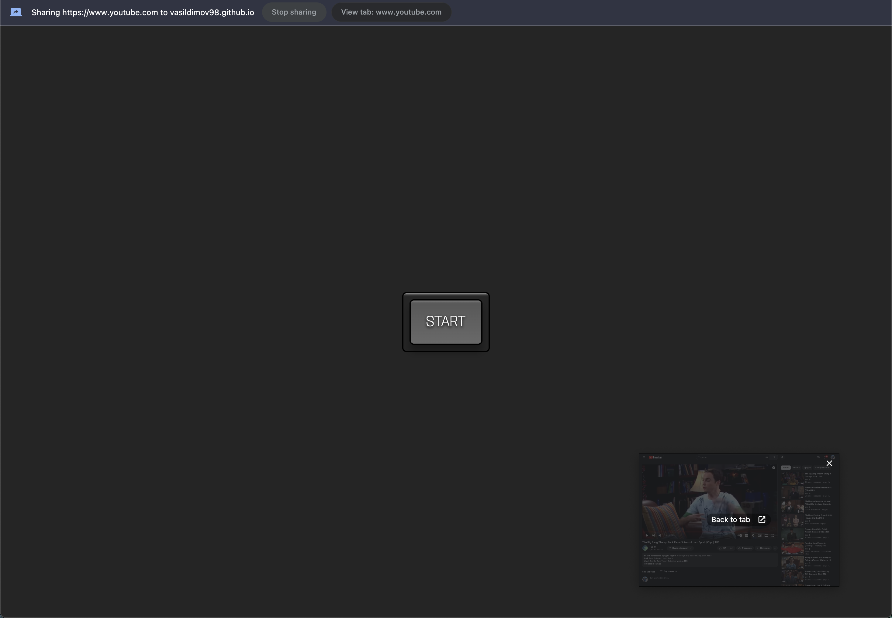

# Picture in Picture

## URL

Check it out:

https://vasildimov98.github.io/03.picture-in-picture/

## Description

Introducing my personal project, a Picture-in-Picture (PiP) feature powered by JavaScript. Elevate your multimedia experience with the ability to watch videos or view images in a resizable, floating window while simultaneously browsing other content.

With this Picture-in-Picture implementation, you can enjoy a multitasking experience like never before. Seamlessly enable PiP mode on supported videos or images, allowing you to continue watching or viewing content while navigating other websites or applications.

